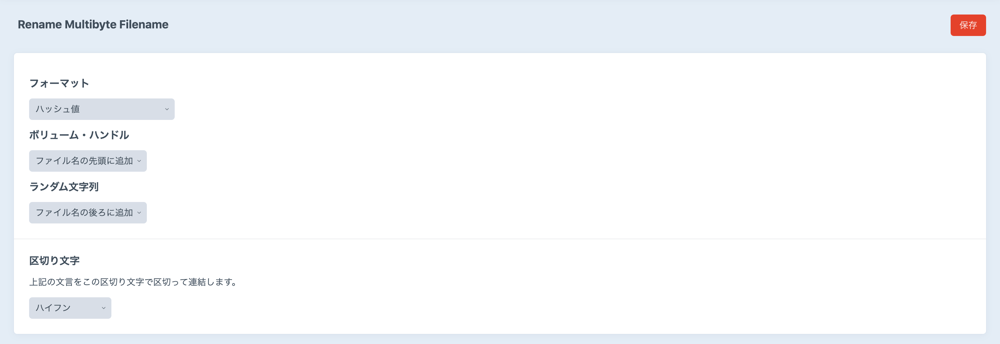

# Rename Multibyte Filename プラグイン（Craft CMS 3.x 用）

[English](README.md)

ファイル名に漢字やひらがな、カタカナなどのマルチバイト文字（全角文字）が含まれているファイルがアップロードされたとき、自動で半角英数のファイル名に変換するプラグインです。

## 必須要件

Craft CMS 3.0.0-beta.23 またはそれ以降のバージョン

## インストール方法

Craft CMS のコントロールパネルからインストールするか、下記の手順に従ってインストールしてください。

1. ターミナルなどのシェルで Craft CMS のプロジェクトフォルダに移動します。

        cd /path/to/project

2. 下記のコマンドを実行します。

        composer require bitpart/rename-multibyte-filename

3. コントロールパネルで「設定 ＞ プラグイン」へと進み、Rename Multibyte Filename プラグインの「インストール」をクリックします。

## 設定方法

### フォーマット

変換後のファイル名の書式を選択します。

- 日時（フォーマット: YmdHis）（例： `20200825203125.png` ）
- ハッシュ値（例： `7b1c6a5ff46e54c0b0f89ea2f0fea8ff.png` ）
- アセットID（例： `123.png` ）

### ボリューム・ハンドル

ファイル名にアセットのボリューム・ハンドル名を追加する方法を選択できます。

- 追加しない
- ファイル名の先頭に追加（例： `images-20200825203125.png` ）
- ファイル名の後ろに追加（例： `20200825203125-images.png` ）

### ランダム文字列

ファイル名に 8 文字のランダムな文字列を追加する方法を選択できます。

- 追加しない
- ファイル名の先頭に追加（例： `wxafqvit-20200825203125.png` ）
- ファイル名の後ろに追加（例： `20200825203125-wxafqvit.png` ）

### 区切り文字

区切り文字を選択できます。ここで選択した区切り文字で、ファイル名、ボリューム・ハンドル、ランダム文字列を連結します。

- ハイフン： `-`
- アンダースコア： `_`
- ドット： `.`
- 区切り文字なし
