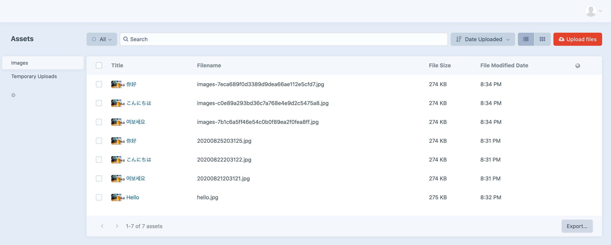

# Rename Multibyte Filename plugin for Craft CMS 3.x

When a file whose filename contains multibyte character is uploaded, the filename will be renamed to ASCII character automatically.



## Requirements

This plugin requires Craft CMS 3.0.0-beta.23 or later.

## Installation

To install the plugin, follow these instructions.

1. Open your terminal and go to your Craft project:

```
cd /path/to/project
```

2. Then tell Composer to load the plugin:

```
composer require bitpart/rename-multibyte-filename
```

3. In the Control Panel, go to Settings → Plugins and click the “Install” button for Rename Multibyte Filename.

## Configuring Rename Multibyte Filename

### Format

You can choose a format from options below.

- Time (Formatted: YmdHis) (e.g. `20200825203125.png` )
- A hash value (e.g. `7b1c6a5ff46e54c0b0f89ea2f0fea8ff.png` )
- Asset ID (e.g. `123.png` )

### Volume Handle Name

You can choose how to add a volume handle to the filename.

- Do not add
- Insert before a filename (e.g. `images-20200825203125.png` )
- Add after a filename (e.g. `20200825203125-images.png` )

### Random String

You can choose how to add a random string (8 characters) to the filename.

- Do not add
- Insert before a filename (e.g. `wxafqvit-20200825203125.png` )
- Add after a filename (e.g. `20200825203125-wxafqvit.png` )

### Delimiter

You can choose a delimiter from the options below. The filename parts above will be joined with the delimiter.

- Hyphen: `-`
- Underscore: `_`
- Dot: `.`
- No delimiter

You can also combine a volume handle and a random string together.
